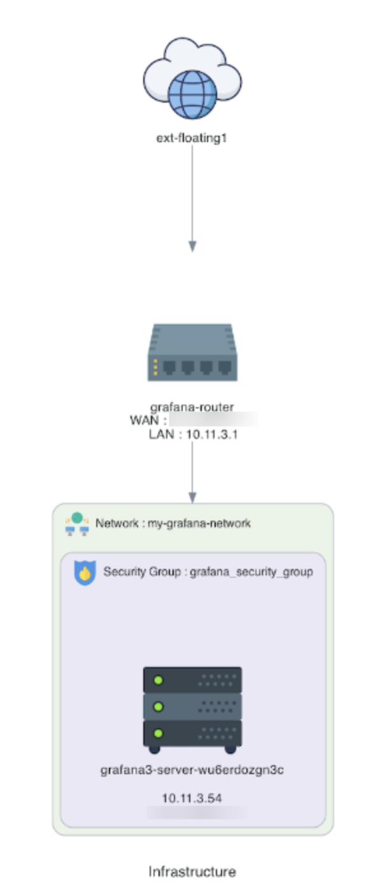
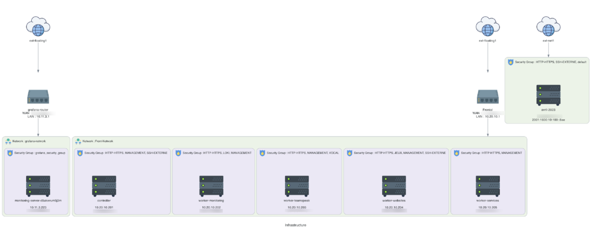
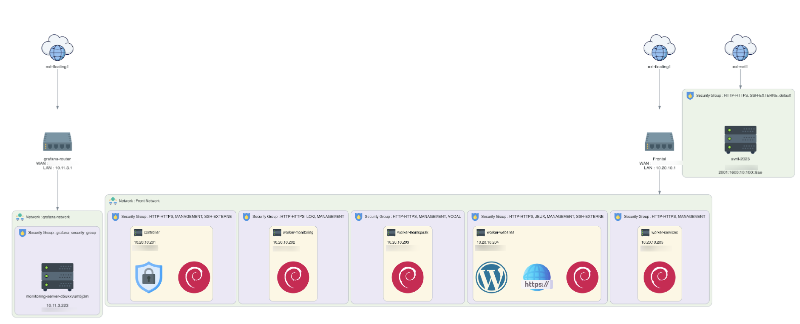

# OpenCraft.cloud
Generate a diagram of your Openstack's project

The goal: to generate a diagrame with a command (or from a web interface) of an OpenStack project.
Inspiration : https://www.cloudcraft.co/

## How to use
You need Docker installed, and 2 folders : `openrc` with your openrc file and `results`.

```
docker run -v ~/openrc:/app/openrc/ -v ~/results:/app/results -it --rm papamica/opencraft:latest ./app.py --openrc openrc/<name_of_your_openrc_file>
```

## Results examples





## Les informations à récupérer dans un premier temps :
 - Les instances ✅
 - Les routeurs ✅
 - Les ports ✅
 - Les IPs ✅
 - Les sécurity groups ✅
 - Les keypairs
 - Faire les interconnexions ✅
 
## Les idées :
 - De beaux icones (3D?)
 - Compatible Draw.io
 - Une base de données pour la récupération des données
 - Une interface web (dans un second temps)
 - Une API (dans un dernier temps)
 - Un sytème de compte
